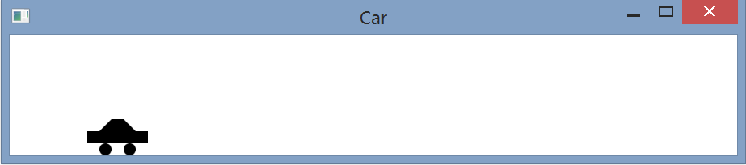

# this looks great. Do include more info on testing - tested each action event for proper functionality, etc.
#  I am not sure why the car would jump....

# Exercise 15.29
Write a program that simulates car racing, as shown in Figure 15.34a. The car moves from left to right. When it hits the right end, it   restarts from the left and continues the same process. You can use a timer to control animation. Redraw the car with a new base coordinates (x, y), as shown in Figure 15.34b. Also let the user pause/resume the animation with a button press/release and increase/decrease the car speed by pressing the UP and DOWN arrow keys.

## Example Output

## Analysis Steps
Create a car with shapes similar to figure 15.34. Then have the car move across the pane while being able to control the speed.

### Design
Had to create a second class for the car.

### Testing

## Notes
The car seems to jump when it goes from fully stopped to moving again.

## Do not change content below this line
## Adapted from a README Built With
*  [Dropwizard](http://www.dropwizard.io/1.0.2/docs/) - The web framework used
*  [Maven](https://maven.apache.org/) - Dependency Management
*  [ROME](https://rometools.github.io/rome/) - Used to generate RSS Feeds

## Contributing

Please read 
[CONTRIBUTING.md](https://gist.github.com/PurpleBooth/b24679402957c63ec426) for details on our code of conduct, and the process for submitting pull requests to us.

## Versioning

We use [SemVer](http://semver.org/) for versioning. For the versions available, see the [tags on this repository](https://github.com/your/project/tags).

## Authors

*  **Billie Thompson** - *Initial work* - 
	[PurpleBooth](https://github.com/PurpleBooth)

See also the list of [contributors](https://github.com/your/project/contributors) who participated in this project.

## License

This project is licensed under the MIT License - see the [LICENSE.md](LICENSE.md) file for details

## Acknowledgments

*  Hat tip to anyone who's code was used
*  Inspiration
*  etc
